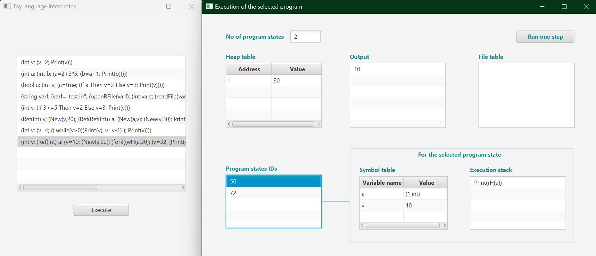
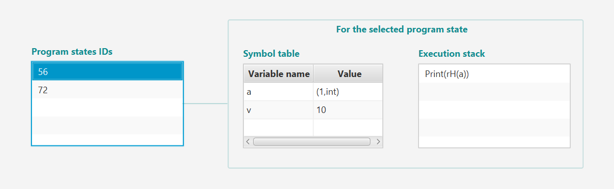
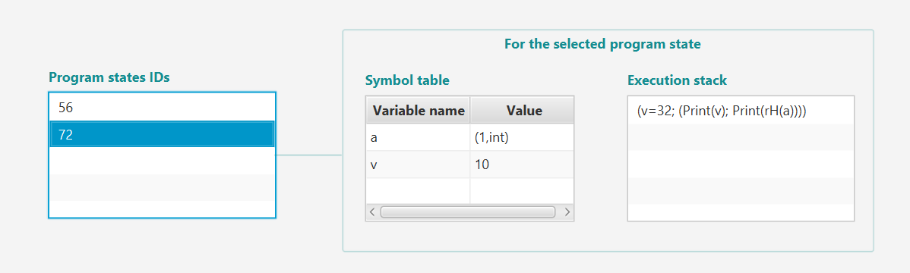

# Toy Language Interpreter

A Java program created for my _Advanced Methods of Programming_ course
that acts as an interpreter for a toy language. <br> <br>

### Description

This application takes hard-coded toy language programs and presents 
their execution through the use of structures such as the _execution stack_, _heap table_, _symbol table_, etc. <br>
Examples of programs in this toy language are:

```
int v; v=4; (while (v>0) print(v); v=v-1); print(v)
```

or

```
int v; Ref int a; 
v=10; new(a,22);   
fork(wH(a,30); v=32; print(v);print(rH(a)));
print(v);print(rH(a))
```

<br>
The application has two windows, one for choosing, from a list of hard-coded
programs, the one to execute, and one that shows the step-by-step execution. <br> <br>



After selecting a program, it is put on the execution stack. <br>
Concurrent execution is possible, and it is managed by the _Program states IDs_ list. 
Each program state has an ID and its own _Symbol table_ and _Execution stack_.

 


<br> <br>

### Technologies

This project is created with: 
- Oracle OpenJDK version: 19
- JavaFX version: 19
